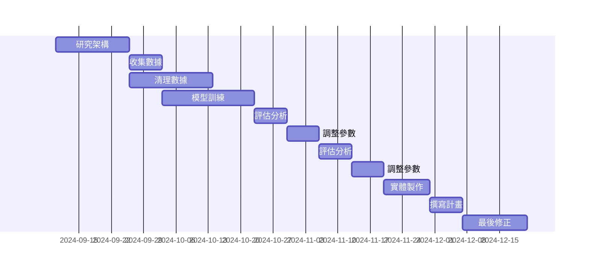

### 甘特圖

### PERT/CPM圖
```mermaid
graph TD
    A[1.研究架構，需時16天] --> B[2.收集數據，需時7天]
    A --> C[3.清理數據，需時18天]
    B --> D[4.模型訓練，需時20天]
    D --> E[5.評估分析，需時7天]
    E --> F[6.調整參數，需時7天]
    F --> G[7.評估分析，需時7天]
    G --> H[8.調整參數，需時7天]
    H --> I[9.實體製作，需時10天]
    I --> J[10.撰寫計畫，需時7天]
    J --> K[11.最後修正，需時14天]

